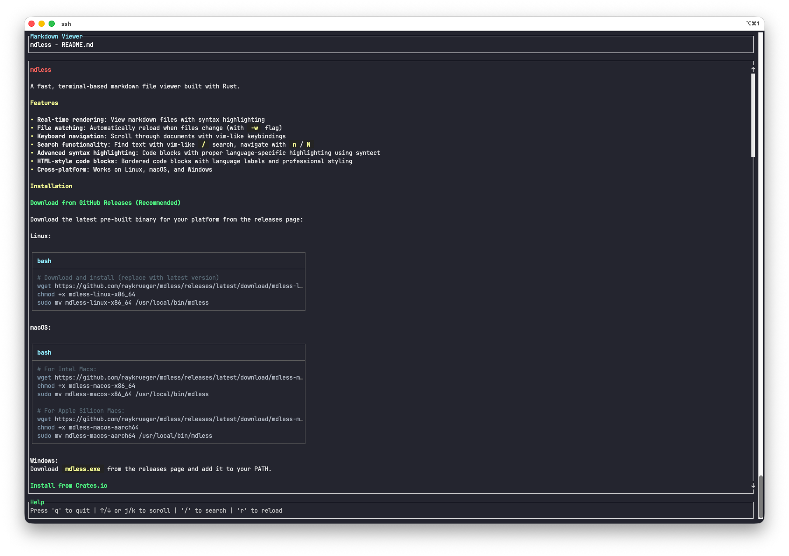

# mdless

A fast, terminal-based markdown file viewer built with Rust.



## Features

- **Real-time rendering**: View markdown files with syntax highlighting
- **File watching**: Automatically reload when files change (with `-w` flag)
- **Keyboard navigation**: Scroll through documents with vim-like keybindings
- **Search functionality**: Find text with vim-like `/` search, navigate with `n`/`N`
- **Advanced syntax highlighting**: Code blocks with proper language-specific highlighting using syntect
- **HTML-style code blocks**: Bordered code blocks with language labels and professional styling
- **Cross-platform**: Works on Linux, macOS, and Windows

## Installation

### Download from GitHub Releases (Recommended)

Download the latest pre-built binary for your platform from the [releases page](https://github.com/raykrueger/mdless/releases):

**Linux:**
```bash
# Download and install (replace with latest version)
wget https://github.com/raykrueger/mdless/releases/latest/download/mdless-linux-x86_64
chmod +x mdless-linux-x86_64
sudo mv mdless-linux-x86_64 /usr/local/bin/mdless
```

**macOS:**
```bash
# For Intel Macs:
wget https://github.com/raykrueger/mdless/releases/latest/download/mdless-macos-x86_64
chmod +x mdless-macos-x86_64
sudo mv mdless-macos-x86_64 /usr/local/bin/mdless

# For Apple Silicon Macs:
wget https://github.com/raykrueger/mdless/releases/latest/download/mdless-macos-aarch64
chmod +x mdless-macos-aarch64
sudo mv mdless-macos-aarch64 /usr/local/bin/mdless
```

**Windows:**
Download `mdless.exe` from the releases page and add it to your PATH.

### Install from Crates.io

```bash
cargo install mdless
```

## Usage

### Basic usage

```bash
mdless README.md
```

### Watch mode (auto-reload on file changes)

```bash
mdless -w README.md
```

## Keybindings

### Basic Controls

| Key | Action                   |
| --- | ------------------------ |
| `q` | Quit the application     |
| `r` | Reload the file manually |

### Search

| Key | Action                        |
| --- | ----------------------------- |
| `/` | Start search (vim-like)       |
| `n` | Go to next search result      |
| `N` | Go to previous search result  |
| `Enter` | Exit search mode (keep results) |
| `Esc` | Cancel search and clear results |

### Vim-Style Movement

| Key               | Action                   |
| ----------------- | ------------------------ |
| `j` / `↓`         | Scroll down one line     |
| `k` / `↑`         | Scroll up one line       |
| `J`               | Scroll down 5 lines      |
| `K`               | Scroll up 5 lines        |
| `d`               | Scroll down half page    |
| `u`               | Scroll up half page      |
| `D`               | Scroll down 10 lines     |
| `U`               | Scroll up 10 lines       |
| `f` / `Page Down` | Scroll down full page    |
| `b` / `Page Up`   | Scroll up full page      |
| `g` / `Home`      | Go to top of document    |
| `G` / `End`       | Go to bottom of document |
| `M`               | Go to middle of document |

## Development

### Prerequisites

- Rust 1.70 or later
- Cargo

### Building

```bash
cargo build --release
```

### Running tests

```bash
cargo test
```

### Code formatting and linting

```bash
cargo fmt
cargo clippy
```

### Pre-commit hooks

The project includes a pre-commit hook that automatically runs formatting checks, linting, compilation verification, and tests before each commit. To install the hook:

```bash
# Install or reinstall the pre-commit hook
./scripts/install-hooks.sh
```

The pre-commit hook will run:

- `cargo check` - Fast compilation check (runs first)
- `cargo fmt --check` - Verify code formatting
- `cargo clippy` - Run linter with warnings as errors
- `cargo test` - Run all tests

To run the checks manually without committing:

```bash
./scripts/pre-commit-checks.sh
```

To bypass the hook for a specific commit (not recommended):

```bash
git commit --no-verify
```

## License

Licensed under the Apache License, Version 2.0 (the "License");
you may not use this file except in compliance with the License.
You may obtain a copy of the License at

    http://www.apache.org/licenses/LICENSE-2.0

Unless required by applicable law or agreed to in writing, software
distributed under the License is distributed on an "AS IS" BASIS,
WITHOUT WARRANTIES OR CONDITIONS OF ANY KIND, either express or implied.
See the License for the specific language governing permissions and
limitations under the License.
